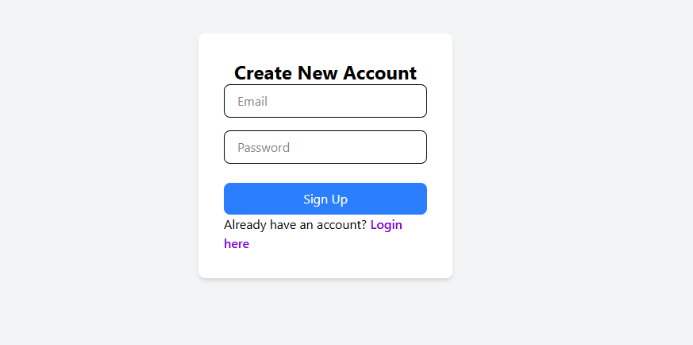
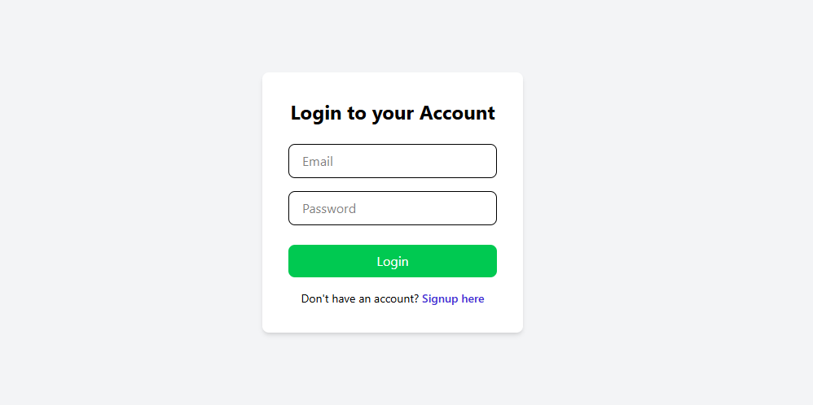

# 🔐 Firebase Authentication using React + Vite + Tailwind

Welcome to the Firebase Auth App! This project allows users to **sign up**, **log in**, and **log out** using Firebase Authentication, built with **React**, **Vite**, and styled using **Tailwind CSS**.

---

## 🚀 Features

- ✅ User Signup
- ✅ User Login
- ✅ Logout functionality
- ✅ Protected Routes (Coming Soon)
- ✅ Tailwind CSS for styling
- ✅ Alert on success and error
- ✅ Smooth navigation with React Router

---

## 📸 Preview

### 🔵 Signup Page

### 🟣 Login Page

### 🟢 Home/Dashboard Page

---

## 🛠️ Tech Stack

| Tech       | Description                       |
|------------|-----------------------------------|
| React      | Frontend JavaScript Library       |
| Firebase   | Backend Authentication            |
| Vite       | Fast Frontend Build Tool          |
| TailwindCSS| Utility-first CSS framework       |
| React Router | For navigation between pages    |

---

## 📁 Folder Structure

src/
├── firebase/
│ └── config.js
├── pages/
│ ├── Login.jsx
│ └── Signup.jsx
├── App.jsx
├── main.jsx
└── index.css
## 🧩 Firebase Setup Instructions

1. Go to [Firebase Console](https://console.firebase.google.com)
2. Create a new project
3. Go to **Authentication > Sign-in method** and enable **Email/Password**
4. Create a web app and get the config keys
5. Paste config in `firebase/config.js`